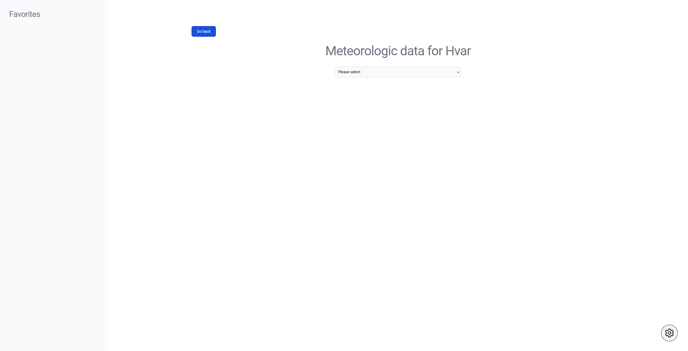
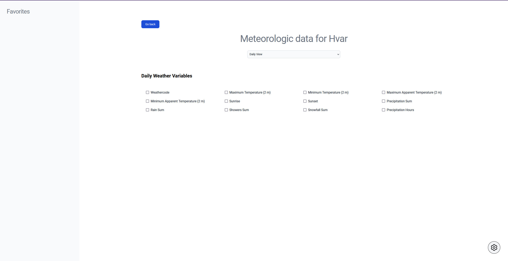
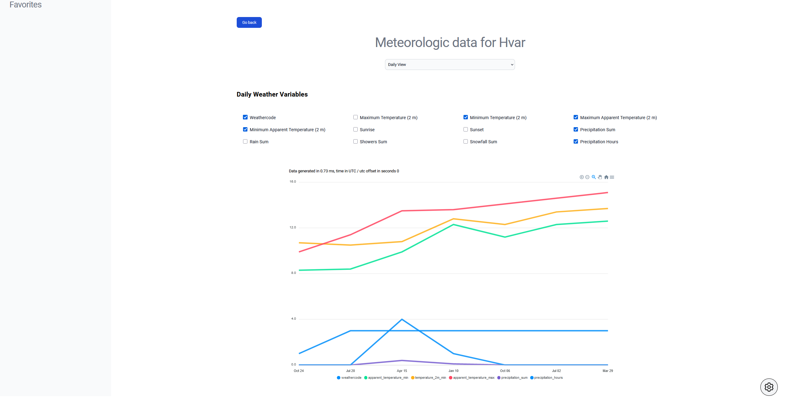
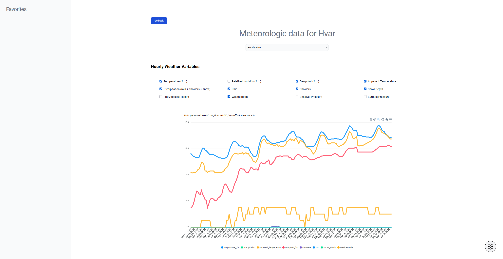

# Meteoapp

Version 1.0.0

# Local project setup
// todo

# Screenshots
## Home Screen

## Settings Modal

## Meteorologic data empty

## Meteorologic data filters

## Meteorologic data chart daily

## Meteorologic data chart hourly

# Decisions
- Successfully installed and configured cypress, but had some problems with my tests so I ended up giving up on testing since there is not much time.
- Used context because I prefer it and only use it when necessary. In my humble opinion redux is an overkill for a project of this size, but I also have experience using redux as well.
- I included empty module css files because I usually use css that way, but since you mentioned tailwind as a bonus I decided to use it as I also use it a lot and love it.
- I tried to use various react caviars and ways of doing things to show that I really do understand js deeply and am really trying my best.
- I am in the middle of my learning journey with typescript, as I wanted this project to be perfect and to reflect my knowledge I decided not to use it in this project, but I wanted to include some safety props checking so I as always included prop-types package until I learn typescript well.
- If I had more time, I would make common components next (Button, Select, RadioGroup, etc), but I focused on bigger more important piece of codes first.

### =====================================================

Due to short deadline, there were some mistakes while pushing the code (wrong branch, etc), But this is of course mostly due to my ambition and will to prove my self, I am not a robot after all.

I am well aware of the bug when you choose different both hourly and daily filter types that chart goes crazy (it still works but timeData gets messed up),
I didnt have time to look into that, so far when choosing only daily or only hourly filters, everything works.